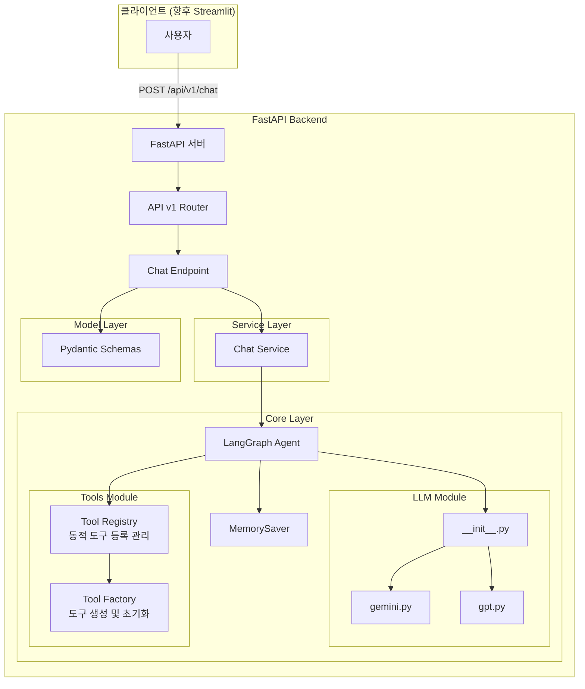
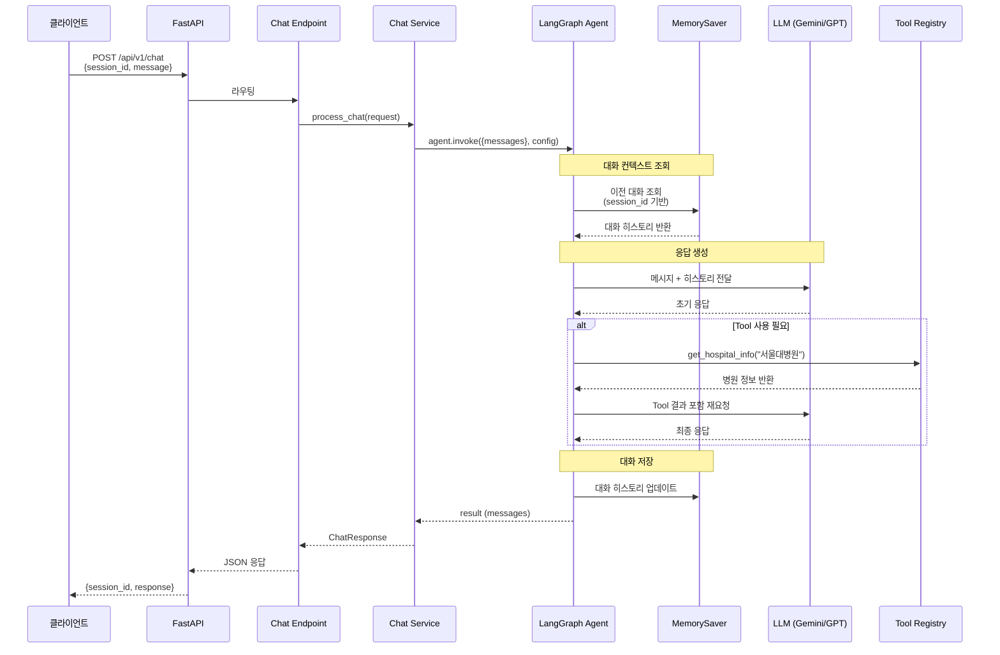

## 🏗️ AI Agent 아키텍처

병원 탐색 AI 에이전트 시스템 아키텍처 문서

 

### 1. 핵심 기능

- 🤖 **멀티턴 대화**: LangGraph + MemorySaver 기반 문맥 유지 대화
- 🔧 **Tool 활용**: 병원 정보 조회, 근처 병원 검색 등
- 🔄 **LLM 전환**: Gemini와 OpenAI GPT 간 손쉬운 전환
- 📝 **세션 관리**: 클라이언트 기반 session_id 관리

 

### 2. 전체 아키텍처

 

### 3. 데이터 흐름

